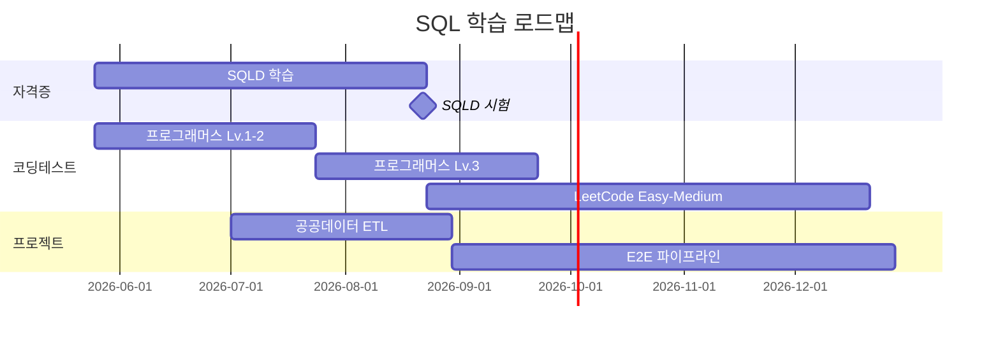

# SQL Practice & SQLD Notes

<div align="center">

[](https://github.com/henry9904/sql-practice/actions/workflows/docs.yml)
[](https://henry9904.github.io/sql-practice/)
[](https://www.dataq.or.kr/)
[](https://github.com/henry9904/sql-practice/commits/main)
[](https://opensource.org/licenses/MIT)

**데이터 엔지니어를 향한 SQL 학습 기록**

[학습 노트 사이트](https://henry9904.github.io/sql-practice/) · [SQLD 노트](sqld/) · [프로그래머스 풀이](programmers/) · [LeetCode](leetcode/)

</div>

---

## About

데이터 엔지니어(DE)로의 전향을 위한 SQL 학습 저장소입니다.
**SQLD 자격증 합격 → 프로그래머스 Lv.3 → LeetCode Medium** 순서로 SQL 기본기를 다집니다.

| 항목 | 내용 |
|---|---|
| 시작일 | 2026-05-25 |
| 1차 목표 | 2026-08-22 SQLD 합격 |
| 최종 목표 | 12~18개월 후 T2~T1 데이터 엔지니어 합격 |

---

## Roadmap



---

## Repository Structure

```
sql-practice/
├── .github/workflows/      # GitHub Actions (자동 배포)
├── docs/                   # MkDocs 사이트 에셋
│   └── stylesheets/
├── docs/sqld/              # SQLD 학습 노트 (11개 챕터)
│   ├── index.md            # 학습 가이드
│   ├── 01_데이터_모델링.md
│   ├── 02_정규화_반정규화.md
│   ├── 03_DDL_DML_TCL.md
│   ├── 04_WHERE_함수.md
│   ├── 05_GROUP_BY_ORDER_BY.md
│   ├── 06_JOIN.md
│   ├── 07_서브쿼리_계층형.md
│   ├── 08_윈도우함수_그룹함수.md
│   ├── 09_PIVOT_UNPIVOT.md           # 2024 개정 신규
│   ├── 10_정규표현식.md              # 2024 개정 신규
│   └── 11_오브젝트_시퀀스_시노님.md
├── docs/programmers/       # 프로그래머스 SQL Kit 풀이
├── docs/leetcode/          # LeetCode SQL 풀이
├── mkdocs.yml              # MkDocs 설정
└── requirements.txt        # Python 의존성
```

---

## Tech Stack

<div align="center">


</div>

---

## Learning Notes

### SQLD (1과목 · 데이터 모델링)
- [01. 데이터 모델링의 이해](docs/sqld/01_데이터_모델링.md) — 엔터티 · 속성 · 관계 · 식별자, 함수적 종속성
- [02. 정규화 & 반정규화](docs/sqld/02_정규화_반정규화.md) — 1NF/2NF/3NF/BCNF, 슈퍼·서브타입

### SQLD (2과목 · SQL 기본)
- [03. DDL · DML · TCL](docs/sqld/03_DDL_DML_TCL.md) — 테이블 관리, 트랜잭션 격리성, 제약조건
- [04. WHERE 절 & 함수](docs/sqld/04_WHERE_함수.md) — 연산자, 함수, CASE / DECODE
- [05. GROUP BY · ORDER BY](docs/sqld/05_GROUP_BY_ORDER_BY.md) — 집계, 정렬, **SELECT 실행순서**

### SQLD (2과목 · SQL 활용)
- [06. JOIN](docs/sqld/06_JOIN.md) — INNER · OUTER · NATURAL · CROSS, 집합 연산자
- [07. 서브쿼리 & 계층형](docs/sqld/07_서브쿼리_계층형.md) — 스칼라 · 인라인뷰, CONNECT BY 가상칼럼
- [08. 윈도우 함수 · TOP-N · DCL](docs/sqld/08_윈도우함수_그룹함수.md) — RANK · WINDOWING, ROWNUM/FETCH, WITH GRANT/ADMIN OPTION

### SQLD (2024 개정 신규)
- [09. PIVOT · UNPIVOT](docs/sqld/09_PIVOT_UNPIVOT.md) — LONG↔WIDE 변환
- [10. 정규표현식](docs/sqld/10_정규표현식.md) — REGEXP_* 함수

### SQLD (관리 구문)
- [11. DB 오브젝트](docs/sqld/11_오브젝트_시퀀스_시노님.md) — View · Sequence · Synonym

---

## Local Development

문서 사이트를 로컬에서 실행하기:

```bash
# 의존성 설치
pip install -r requirements.txt

# 로컬 서버 실행 (http://127.0.0.1:8000)
mkdocs serve

# 정적 사이트 빌드
mkdocs build
```

---

## License

이 저장소의 학습 노트는 [MIT License](LICENSE) 하에 자유롭게 사용 가능합니다.
SQLD 시험 문제 자체는 한국데이터산업진흥원의 저작권에 속합니다.

---
