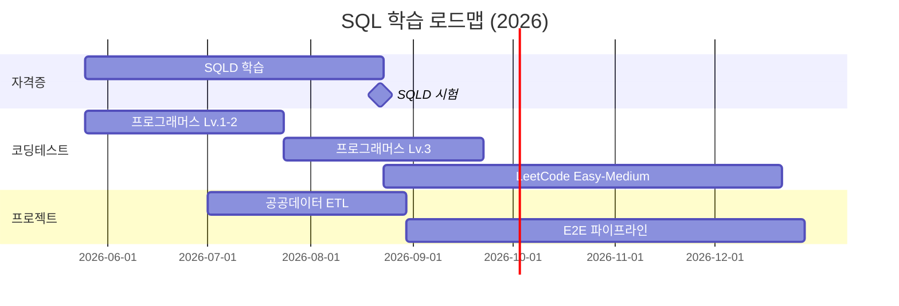

# SQL Practice & SQLD Notes

데이터 엔지니어를 향한 SQL 학습 기록.

---

## 학습 트랙

- **SQLD 자격증**
  ---
  2026년 8월 22일 시험 대비 학습 노트.
  데이터 모델링, SQL 기본·활용, 윈도우 함수, DCL.

  [SQLD 노트 →](sqld/index.md)

- **프로그래머스 SQL Kit**
  ---
  한국 코딩테스트 표준. Lv.1부터 Lv.3까지 풀이 노트.

  [풀이 보기 →](programmers/index.md)

- **LeetCode Database**
  ---
  글로벌 표준 SQL 문제. Top 50 SQL 스터디 플랜.

  [풀이 보기 →](leetcode/index.md)

---

## 학습 로드맵

---

## SQLD 학습 범위 (한눈에)

### 1과목 — 데이터 모델링 (10문항)
- [01. 데이터 모델링의 이해](sqld/01_데이터_모델링.md)
- [02. 정규화 & 반정규화](sqld/02_정규화_반정규화.md)

### 2과목 — SQL 기본 및 활용 (40문항)
- [03. DDL · DML · TCL](sqld/03_DDL_DML_TCL.md)
- [04. WHERE 절 & 함수](sqld/04_WHERE_함수.md)
- [05. GROUP BY · ORDER BY](sqld/05_GROUP_BY_ORDER_BY.md)
- [06. JOIN](sqld/06_JOIN.md)
- [07. 서브쿼리 & 계층형](sqld/07_서브쿼리_계층형.md)
- [08. 윈도우 함수 · TOP-N · DCL](sqld/08_윈도우함수_그룹함수.md)

### 2024 개정 신규 항목 (시험 출제 우선)
- [09. PIVOT · UNPIVOT](sqld/09_PIVOT_UNPIVOT.md)
- [10. 정규표현식](sqld/10_정규표현식.md)

### 관리 구문
- [11. DB 오브젝트 (View · Sequence · Synonym)](sqld/11_오브젝트_시퀀스_시노님.md)
