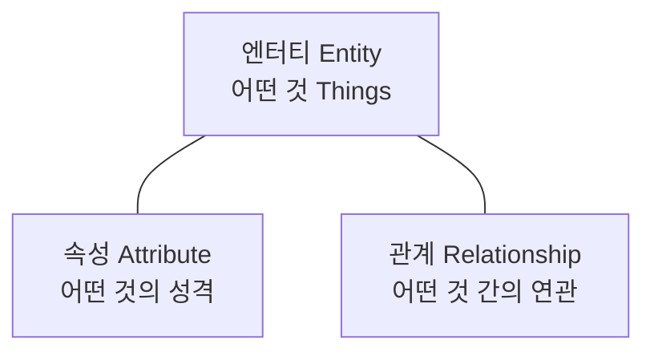

# 01. 데이터 모델링의 이해

> **1과목 · 10문항** — 개념 위주, 암기 비중 높음. ★ = 시험 빈출

---

## 1. 모델링 개요

### 정의
> "다양한 현상을 표기법에 의해 표기하는 것"

### ★ 모델링 특징 3가지
| 특징 | 설명 |
|---|---|
| **추상화** | 일정한 양식에 맞춰 표현 |
| **단순화** | 복잡한 현실을 단순하게 |
| **명확화** | 애매모호함 제거, 정확하게 표현 |

### 모델링 3가지 관점
- **데이터 관점**: 무엇(What)을 다루는가
- **프로세스 관점**: 어떻게(How) 처리하는가
- **상관 관점**: 데이터와 프로세스의 관계

---

## 2. 데이터 모델링 3단계


| 단계 | 추상화 | 산출물 | 특징 |
|---|---|---|---|
| **개념적** | 높음 | 핵심 ERD | 업무 중심, 포괄적, DBMS 독립적 |
| **논리적** | 중간 | 상세 ERD | Key·속성·관계 정확, **재사용성 높음** |
| **물리적** | 낮음 | DDL | 성능·저장 고려, DBMS 종속 |

> **실제 프로젝트**: 분석 단계에서 개념+논리 모델링, 설계 단계에서 물리 모델링

---

## 3. ★ 데이터 모델링 유의점

| 유의점 | 의미 |
|---|---|
| **중복 (Duplication)** | 같은 데이터를 여러 곳에 저장하지 않게 |
| **비유연성 (Inflexibility)** | 데이터 정의와 프로세스 정의를 분리 |
| **비일관성 (Inconsistency)** | 데이터 간 상호 연관관계 명확히 정의 |

---

## 4. 데이터 독립성

### DB 3단계 구조
```
┌─────────────────────────┐
│  외부 단계 (External)    │ ← 사용자 뷰
├─────────────────────────┤
│  개념 단계 (Conceptual) │ ← 통합 스키마
├─────────────────────────┤
│  내부 단계 (Internal)   │ ← 저장 구조
└─────────────────────────┘
```

| 스키마 | 설명 |
|---|---|
| 외부 스키마 | 사용자 관점, 뷰 단위 |
| 개념 스키마 | 통합된 데이터베이스 구조 |
| 내부 스키마 | 물리적 저장 구조 |

### ★ 데이터 독립성 종류
- **논리적 독립성**: 개념 스키마 변경이 외부 스키마에 영향 X
- **물리적 독립성**: 내부 스키마 변경이 개념 스키마에 영향 X

### ★ 사상 (Mapping)
> "상호 독립적인 개념을 연결시켜주는 다리"

- 외부적/개념적 사상 (논리적 사상)
- 개념적/물리적 사상 (물리적 사상)

---

## 5. 모델링의 3가지 요소



| 집합 개념 (타입/클래스) | 개별 개념 (어커런스/인스턴스) |
|---|---|
| 엔터티타입 (Entity Type) | 엔터티 (Entity) / 인스턴스 |
| 관계 (Relationship) | 패어링 (Pairing) |
| 속성 (Attribute) | 속성값 (Attribute Value) |

---

## 6. ERD (Entity Relationship Diagram)

### 표기법

| 요소 | Peter Chen 표기법 | IE 표기법 |
|---|---|---|
| 엔터티 | 사각형 | 사각형 |
| 관계 | 마름모 | 선 |
| 속성 | 타원형 | 사각형 내부 |

### ★ ERD 작성 순서 (암기 필수)
```
1. 엔터티 그리기
2. 엔터티 적절히 배치
3. 엔터티 간의 관계 설정
4. 관계명 기술
5. 관계의 참여도 기술
6. 관계의 필수여부 기술
```

### ★ 좋은 데이터 모델의 요소
- **완전성**: 업무에서 필요한 모든 정보 표현
- **중복배제**: 동일 사실 한 번만 기록
- **업무규칙**: 업무 룰을 데이터 모델에 반영
- **데이터 재사용**: 통합된 데이터 구조
- **의사소통**: 다양한 이해관계자와 의사소통 도구
- **통합성**: 동일 데이터는 한 번만 정의

---

## 7. 엔터티 (Entity)

### 개념
> "실체, 객체" — 업무에 필요하고 저장가치가 있는 정보의 집합

### 엔터티의 6가지 특징
1. 업무에서 필요로 하는 정보
2. **식별자에 의해 식별 가능**
3. **인스턴스의 집합** (인스턴스 2개 이상)
4. 업무 프로세스에 의해 이용
5. **속성을 포함** (속성 2개 이상)
6. **다른 엔터티와 관계 존재**

### ★ 엔터티 분류

| 분류 기준 | 종류 | 예시 |
|---|---|---|
| **유무형** | 유형 엔터티 | 사원, 물품, 강사 (물리적 형태) |
| | 개념 엔터티 | 조직, 보험상품, 회사 (개념적) |
| | 사건 엔터티 | 주문, 청구, 미납 (행위) |
| **발생시점** | 기본 엔터티 | 사원, 부서, 고객 (원래부터 존재) |
| | 중심 엔터티 | 주문, 매출 (기본에서 발생, 다른 엔터티의 모체) |
| | 행위 엔터티 | 주문목록, 사원변경이력 (두 엔터티 이상에서 발생) |

---

## 8. 속성 (Attribute)

### 정의
> "업무에서 필요로 하는 인스턴스로 관리하고자 하는 의미상 더 이상 분리되지 않는 최소의 데이터 단위"

### 엔터티·인스턴스·속성·속성값 관계
- 한 개의 엔터티 → 두 개 이상의 인스턴스
- 한 개의 엔터티 → 두 개 이상의 속성
- 한 개의 속성 → **한 개의 속성값** (다중값이면 별도 엔터티로 분리)

### ★ 속성 분류

#### (1) 특성에 따른 분류
| 종류 | 설명 | 예시 |
|---|---|---|
| **기본 속성** | 업무로부터 추출한 본래 속성 | 회원ID, 이름, 주민번호 |
| **설계 속성** | 데이터 모델링 과정에서 발생 | 일련번호, 코드 |
| **파생 속성** | 다른 속성의 영향을 받아 계산 | 나이(생년월일 기반), 합계 |

#### (2) 구성방식에 따른 분류
- **PK 속성**: 엔터티를 식별
- **FK 속성**: 다른 엔터티와의 관계에서 포함
- **일반 속성**: PK/FK 외의 속성

#### (3) 분해 가능 여부
- **단순형**: 더 분해 불가능
- **복합형**: 분해 가능 (예: 주소 = 도시 + 구 + 동)

#### (4) 값 개수
- **단일값 (Single Value)**: 속성 하나에 값 하나
- **다중값 (Multi Value)**: 여러 값 → 별도 엔터티로 분리

### ★ 도메인 (Domain)
> "각 속성이 가질 수 있는 값의 범위"

- 데이터 타입, 크기, 제약사항을 지정
- 예: `이름 VARCHAR2(20) NOT NULL`

---

## 9. 관계 (Relationship)

### 정의
> "엔터티의 인스턴스 사이의 논리적인 연관성"

### 관계의 종류
| 분류 기준 | 종류 |
|---|---|
| ERD 관점 | 존재에 의한 관계 / 행위에 의한 관계 |
| UML 관점 | 연관 관계 (Association) / 의존 관계 (Dependency) |

### ★ 관계의 표기법 3요소
1. **관계명 (Membership)**: 관계의 이름
2. **관계차수 (Cardinality)**: 1:1, 1:M, M:N
3. **관계선택사양 (Optionality)**: 필수 관계 / 선택 관계

### 관계 차수
```
1:1     ┃────────┃
1:M     ┃────────┣
M:N     ┣────────┣    ← 중간 테이블로 분해 필요
```

---

## 10. 식별자 (Identifier)

### 개념
- 엔터티를 대표하는 속성
- **하나의 엔터티는 반드시 하나의 유일한 식별자가 존재**

### ★ 식별자 특징 (암기 필수)
| 특징 | 의미 |
|---|---|
| **유일성** | 인스턴스를 유일하게 구분 |
| **최소성** | 유일성을 만족하는 **최소 수의 속성** |
| **불변성** | 한 번 부여되면 잘 변하지 않음 |
| **존재성** | NULL 값을 가질 수 없음 |

### ★ 식별자 분류
| 분류 기준 | 종류 | 설명 |
|---|---|---|
| **대표성 여부** | 주식별자 / 보조식별자 | PK / UK |
| **스스로 생성 여부** | 내부식별자 / 외부식별자 | 자체생성 / FK |
| **속성 수** | 단일식별자 / 복합식별자 | 1개 / 2개 이상 |
| **대체 여부** | 본질식별자 / 인조식별자 | 업무 의미 / 인위적 부여 |

### ★ 주식별자 도출 기준
1. 해당 업무에서 자주 이용되는 속성
2. **명칭, 내역 등은 피한다** (변경 가능성)
3. 속성의 수가 많아지지 않도록 한다 → 인조식별자 고려

---

## 11. ★ 식별자 관계 vs 비식별자 관계

| 구분 | 식별자 관계 | 비식별자 관계 |
|---|---|---|
| **부모 PK** | 자식 PK로 상속 | 자식 일반 속성으로 상속 |
| **표기** | 실선 | 점선 |
| **NULL 허용** | 불가 (부모 먼저 생성 필수) | 가능 |
| **강한 연결** | 강함 | 약함 |

### 식별자 관계로만 설정 시 문제
- 주식별자 속성이 **지속적으로 증가**
- 복잡성과 오류 가능성 유발

### 비식별자 관계로만 설정 시 문제
- 부모 엔터티까지 **불필요하게 조인 발생**

---

## 시험 핵심 체크리스트

- [ ] 모델링 3가지 특징: 추상화, 단순화, 명확화
- [ ] 데이터 모델링 3단계 순서 + 산출물
- [ ] 데이터 독립성 (논리적/물리적) + 사상의 개념
- [ ] 엔터티 6가지 특징
- [ ] 엔터티 분류 (유형/개념/사건, 기본/중심/행위)
- [ ] 속성 분류 (기본/설계/파생)
- [ ] 도메인의 정의
- [ ] 관계 표기법 3요소
- [ ] 식별자 4가지 특징 (유일성·최소성·불변성·존재성)
- [ ] 식별자 vs 비식별자 관계의 트레이드오프
- [ ] ERD 작성 순서 6단계
