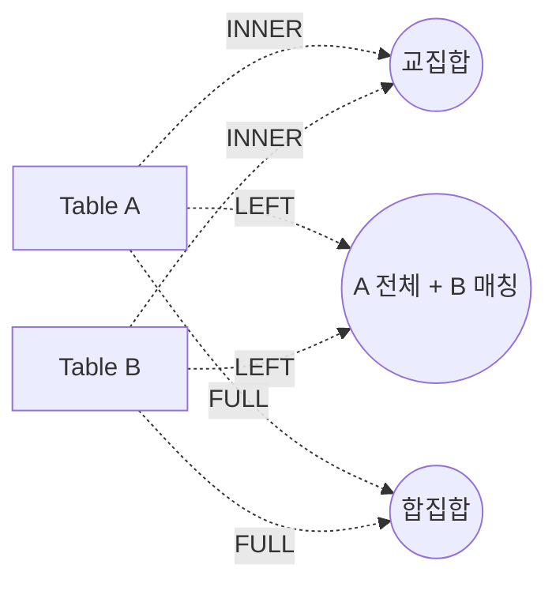

# 06. JOIN

> **2과목 · SQL 활용**. ★ = 시험 빈출 / JOIN은 전 회차 출제

---

## 1. JOIN 개요

> "두 개 이상의 테이블들을 **연결 또는 결합**하여 데이터를 출력하는 것"

- 대부분 **PK ↔ FK** 관계를 기반
- 반드시 PK-FK 관계여야 하는 것은 아님

---

## 2. 표준 SQL 연산자

### ★ 일반 집합 연산자 ↔ 현재 SQL

| 일반 집합 연산자 | 현재 SQL |
|---|---|
| UNION | `UNION` |
| INTERSECTION | `INTERSECT` |
| DIFFERENCE | `EXCEPT` (SQL Server) / `MINUS` (Oracle) |
| PRODUCT | `CROSS JOIN` (CARTESIAN PRODUCT) |

### ★ 순수 관계 연산자 ↔ 현재 SQL

| 순수 관계 연산자 | 현재 SQL |
|---|---|
| SELECT | `WHERE` |
| PROJECT | `SELECT` |
| (NATURAL) JOIN | 다양한 `JOIN` |
| DIVIDE | 현재 사용 안 함 |

> ★ 이름이 헷갈리기 쉬움 (SELECT가 WHERE에 대응!)

---

## 3. EQUI JOIN (등가 조인)

> 두 테이블의 칼럼 값이 **정확히 일치**할 때 사용

```sql
-- 전통적 방식 (Oracle)
SELECT P.PLAYER_NAME, T.TEAM_NAME
FROM PLAYER P, TEAM T
WHERE P.TEAM_ID = T.TEAM_ID;

-- ANSI 방식 (권장)
SELECT P.PLAYER_NAME, T.TEAM_NAME
FROM PLAYER P INNER JOIN TEAM T
  ON P.TEAM_ID = T.TEAM_ID;
```

---

## 4. ★ Non EQUI JOIN (비등가 조인)

> `=` 대신 `BETWEEN`, `>`, `<`, `<=`, `>=` 등으로 JOIN

```sql
-- 사원의 급여에 해당하는 등급을 조회
SELECT E.ENAME, E.SAL, S.GRADE
FROM EMP E, SALGRADE S
WHERE E.SAL BETWEEN S.LOSAL AND S.HISAL;
```

---

## 5. ★ ANSI/ISO 표준 JOIN

### INNER JOIN
- **양쪽 다 존재하는 행만** 반환
- DEFAULT 옵션 (`JOIN` = `INNER JOIN`)
- USING 또는 ON 조건절 **필수**

```sql
SELECT EMP.DEPTNO, EMPNO, ENAME, DNAME
FROM EMP INNER JOIN DEPT ON EMP.DEPTNO = DEPT.DEPTNO;
```

### ★ NATURAL JOIN
- 두 테이블의 **동일한 이름 칼럼 모두**에 자동으로 EQUI JOIN
- ★ **WHERE/USING/ON 조건절 사용 불가**
- ★ **ALIAS/테이블명 접두사 사용 불가** (예: `EMP.DEPTNO` X)

```sql
SELECT DEPTNO, EMPNO, ENAME, DNAME
FROM EMP NATURAL JOIN DEPT;
-- DEPTNO에 접두사 붙이면 에러
```

### ★ USING 조건절
- 같은 이름 칼럼 중 **원하는 것만 선택**적으로 JOIN
- ★ **SQL Server 미지원**
- JOIN 칼럼에 **접두사 사용 불가**

```sql
SELECT * FROM DEPT JOIN DEPT_TEMP USING (DEPTNO);
-- USING에 들어간 DEPTNO는 접두사 X
```

### ★ ON 조건절
- 칼럼명이 달라도 JOIN 조건 사용 가능
- WHERE 절과 혼용 가능
- ★ **ALIAS/테이블명 접두사 반드시 사용해야 함**

```sql
SELECT E.ENAME, E.DEPTNO, D.DNAME
FROM EMP E JOIN DEPT D ON (E.DEPTNO = D.DEPTNO)
WHERE E.DEPTNO = 30;
```

#### ON 조건절 + 데이터 검증
```sql
-- ON에 추가 조건
SELECT E.ENAME, D.DNAME
FROM EMP E JOIN DEPT D
  ON (E.DEPTNO = D.DEPTNO AND E.MGR = 7698);

-- WHERE로 분리 (동일 결과)
SELECT E.ENAME, D.DNAME
FROM EMP E JOIN DEPT D ON (E.DEPTNO = D.DEPTNO)
WHERE E.MGR = 7698;
```

### CROSS JOIN (CARTESIAN PRODUCT)
> JOIN 조건이 없는 경우 생길 수 있는 **모든 데이터 조합**

```sql
SELECT ENAME, DNAME FROM EMP CROSS JOIN DEPT;
-- EMP 14건 × DEPT 4건 = 56건 출력
```

### ★ OUTER JOIN
> JOIN 조건에서 동일한 값이 없는 행도 (NULL 포함) 출력

#### LEFT OUTER JOIN
> 좌측 테이블의 모든 행 + 우측 매칭 (없으면 NULL)

```sql
SELECT S.STADIUM_NAME, T.TEAM_NAME
FROM STADIUM S LEFT OUTER JOIN TEAM T
  ON S.HOMETEAM_ID = T.TEAM_ID;
-- "OUTER"는 생략 가능: LEFT JOIN
```

#### RIGHT OUTER JOIN
> 우측 테이블의 모든 행 + 좌측 매칭

#### FULL OUTER JOIN
> 양쪽 모두 (합집합 개념)

---

## 6. ★ JOIN 종류별 비교

> TAB1 = {B, C, D, E}, TAB2 = {A, B, C}

| JOIN | 결과 | 건수 |
|---|---|---|
| **INNER JOIN** | B-B, C-C | 2 |
| **LEFT OUTER** | B-B, C-C, D-NULL, E-NULL | 4 |
| **RIGHT OUTER** | NULL-A, B-B, C-C | 3 |
| **FULL OUTER** | NULL-A, B-B, C-C, D-NULL, E-NULL | 5 |
| **CROSS JOIN** | 4 × 3 = 12건 모든 조합 | 12 |



---

## 7. SELF JOIN

> "동일 테이블 사이의 조인" — 반드시 **테이블 별칭(Alias) 사용**

```sql
-- 사원과 그 매니저 출력
SELECT A.ENAME 사원, B.ENAME 관리자
FROM EMP A, EMP B
WHERE A.MGR = B.EMPNO;
```

---

## 8. 3개 이상 테이블 JOIN

```sql
-- 선수 → 팀 → 경기장
SELECT P.PLAYER_NAME 선수명,
       T.TEAM_NAME   팀명,
       S.STADIUM_NAME 구장명
FROM PLAYER P
JOIN TEAM    T ON P.TEAM_ID = T.TEAM_ID
JOIN STADIUM S ON T.STADIUM_ID = S.STADIUM_ID
ORDER BY 선수명;
```

---

## 9. 집합 연산자

### 종류

| 연산자 | 의미 |
|---|---|
| `UNION` | **합집합 (중복 제거)** |
| `UNION ALL` | 합집합 (중복 포함, **정렬 안함**) |
| `INTERSECT` | 교집합 |
| `EXCEPT` / `MINUS` | 차집합 |

### ★ 사용 조건
1. SELECT 절의 **칼럼 수가 동일**해야 함
2. 동일 위치 칼럼의 **데이터 타입 호환** 가능
3. **칼럼명은 달라도 됨** (첫 SELECT의 이름으로 결정)

### 예시
```sql
SELECT DEPTNO FROM EMP
UNION
SELECT DEPTNO FROM DEPT_BACKUP
ORDER BY DEPTNO;
```

### UNION vs UNION ALL 성능
- `UNION`: 중복 제거 작업 → 느림
- `UNION ALL`: 중복 그대로 → 빠름 (중복 없음이 확실하면 권장)

---

## 시험 핵심 체크리스트

- [ ] 일반 집합 연산자 ↔ 현재 SQL 대응
- [ ] 순수 관계 연산자 ↔ 현재 SQL 대응
- [ ] NATURAL JOIN의 제약 (접두사 X, 조건절 X)
- [ ] USING 조건절의 제약 (접두사 X, SQL Server X)
- [ ] ON 조건절은 **반드시 접두사 사용**
- [ ] OUTER JOIN의 LEFT/RIGHT/FULL 결과 차이
- [ ] CROSS JOIN의 결과 행 수 (m × n)
- [ ] SELF JOIN은 ALIAS 필수
- [ ] UNION vs UNION ALL 차이
- [ ] 집합 연산자 사용 조건 (칼럼 수·타입)
