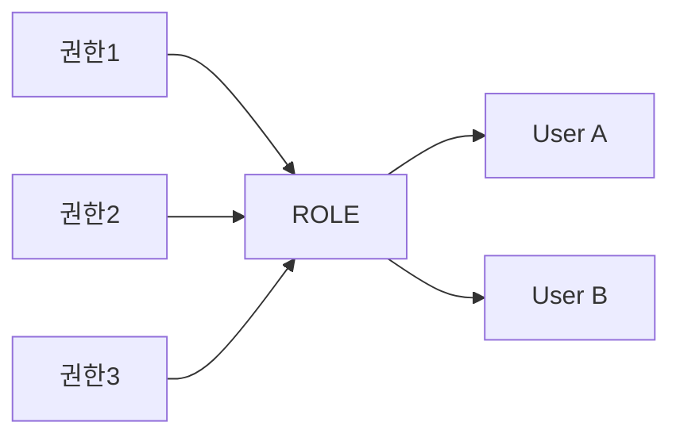

# 08. 윈도우 함수 · 그룹 함수 · DCL

> **2과목 · SQL 활용 / DCL**. ★ = 시험 빈출

---

## 1. 데이터 분석 함수 분류

| 종류 | 특징 |
|---|---|
| **Aggregate Function** | 집계 (SUM, AVG, COUNT...) |
| **Group Function** | 그룹 (ROLLUP, CUBE, GROUPING SETS) |
| **Window Function** | 행 단위 분석 (OVER 절 사용) |

---

## 2. ★ 그룹 함수 (Group Function)

### ROLLUP

> N개 칼럼 → **N+1 레벨의 Subtotal** 생성  
> ★ **계층 구조** → 인수 순서 바뀌면 결과 바뀜

```sql
SELECT DNAME, JOB, COUNT(*), SUM(SAL)
FROM EMP E, DEPT D
WHERE E.DEPTNO = D.DEPTNO
GROUP BY ROLLUP(DNAME, JOB);
```

생성되는 집계 레벨:
1. (DNAME, JOB) 별 소계
2. DNAME 별 소계
3. **전체 합계**

### CUBE

> 결합 가능한 **모든 값**에 대해 다차원 집계 생성  
> 인수 순서 달라도 결과 동일

```sql
SELECT DNAME, JOB, COUNT(*), SUM(SAL)
FROM EMP E, DEPT D
WHERE E.DEPTNO = D.DEPTNO
GROUP BY CUBE(DNAME, JOB);
```

생성되는 집계 레벨:
1. (DNAME, JOB)
2. DNAME 만
3. JOB 만
4. 전체

### GROUPING SETS

> 원하는 부분의 소계만 **선택적**으로 추출  
> 인수는 평등한 관계 → 순서 무관

```sql
SELECT DNAME, JOB, COUNT(*), SUM(SAL)
FROM EMP E, DEPT D
WHERE E.DEPTNO = D.DEPTNO
GROUP BY GROUPING SETS(DNAME, JOB);
-- DNAME 별 + JOB 별 소계만 (전체 합계 X)
```

### ★ ROLLUP vs CUBE vs GROUPING SETS 비교

| 그룹 함수 | 생성 레벨 | 순서 영향 |
|---|---|---|
| `ROLLUP(A, B)` | A+B, A, 전체 | **있음** |
| `CUBE(A, B)` | A+B, A, B, 전체 | 없음 |
| `GROUPING SETS(A, B)` | A, B만 | 없음 |

### GROUPING 함수
```sql
SELECT DNAME, JOB,
       GROUPING(DNAME) AS G_DNAME,
       GROUPING(JOB)   AS G_JOB,
       SUM(SAL)
FROM EMP E, DEPT D
WHERE E.DEPTNO = D.DEPTNO
GROUP BY CUBE(DNAME, JOB);
```

- `GROUPING(칼럼) = 1` → 해당 칼럼은 **소계용**
- `GROUPING(칼럼) = 0` → 일반 집계 행

---

## 3. ★ 윈도우 함수 (Window Function)

### 개요
- 분석 함수 / 순위 함수
- ★ **OVER 절 필수**

### 문법
```sql
SELECT WINDOW_FUNCTION(인수)
  OVER (
    [PARTITION BY 칼럼]   -- 그룹 기준
    [ORDER BY 칼럼]        -- 정렬 기준
    [WINDOWING 절]         -- 범위 지정
  )
FROM 테이블;
```

---

## 4. ★ WINDOWING 절 (출제 단골)

### ROWS vs RANGE
| 종류 | 기준 |
|---|---|
| `ROWS` | **물리적 행 수** |
| `RANGE` | 논리적 값 범위 |

### 범위 키워드
| 키워드 | 의미 |
|---|---|
| `UNBOUNDED PRECEDING` | 처음부터 |
| `N PRECEDING` | N행 앞부터 |
| `CURRENT ROW` | 현재 행 |
| `N FOLLOWING` | N행 뒤까지 |
| `UNBOUNDED FOLLOWING` | 마지막까지 |

### 예시
```sql
-- 누적 합계 (처음부터 현재 행까지)
SELECT ENAME, SAL,
       SUM(SAL) OVER (ORDER BY EMPNO
         ROWS BETWEEN UNBOUNDED PRECEDING AND CURRENT ROW) AS 누적
FROM EMP;

-- 이동 평균 (앞 2행 ~ 뒤 2행)
SELECT ENAME, SAL,
       AVG(SAL) OVER (ORDER BY EMPNO
         ROWS BETWEEN 2 PRECEDING AND 2 FOLLOWING) AS 이동평균
FROM EMP;
```

---

## 5. ★ 순위 함수 (Rank Function)

| 함수 | 동일값 처리 | 예시 (값 1,1,1,2) |
|---|---|---|
| `RANK()` | 같은 순위 부여, **다음 순위 건너뜀** | 1, 1, 1, **4** |
| `DENSE_RANK()` | 같은 순위 부여, **다음 순위 안 건너뜀** | 1, 1, 1, **2** |
| `ROW_NUMBER()` | **고유 순위** (동일값도) | 1, 2, 3, 4 |

```sql
SELECT JOB, ENAME, SAL,
       RANK()         OVER (ORDER BY SAL DESC) ALL_RANK,
       RANK()         OVER (PARTITION BY JOB ORDER BY SAL DESC) JOB_RANK,
       DENSE_RANK()   OVER (ORDER BY SAL DESC) DENSE_RANK,
       ROW_NUMBER()   OVER (ORDER BY SAL DESC) ROW_NUM
FROM EMP;
```

---

## 6. 일반 집계 함수 (Window 형태)

```sql
SELECT ENAME, DEPTNO, SAL,
       SUM(SAL)   OVER (PARTITION BY DEPTNO) AS 부서합,
       AVG(SAL)   OVER (PARTITION BY DEPTNO) AS 부서평균,
       MAX(SAL)   OVER (PARTITION BY DEPTNO) AS 부서최대,
       MIN(SAL)   OVER (PARTITION BY DEPTNO) AS 부서최소,
       COUNT(*)   OVER (PARTITION BY DEPTNO) AS 부서인원
FROM EMP;
```

---

## 7. ★ 행 순서 함수

| 함수 | 설명 |
|---|---|
| `FIRST_VALUE` | 파티션 내 첫 행 값 |
| `LAST_VALUE` | 파티션 내 마지막 행 값 |
| `LAG(칼럼, n, default)` | **이전 n번째** 행 값 |
| `LEAD(칼럼, n, default)` | **이후 n번째** 행 값 |

```sql
-- LAG: 전월 대비 증감
SELECT YYYYMM, SALES,
       LAG(SALES, 1, 0) OVER (ORDER BY YYYYMM) AS 전월매출,
       SALES - LAG(SALES, 1, 0) OVER (ORDER BY YYYYMM) AS 증감
FROM MONTHLY_SALES;
```

> `LAG(칼럼)`은 기본 1행 전, 누락된 경우 NULL — `default` 인수로 대체 가능

---

## 8. 비율 함수

| 함수 | 설명 |
|---|---|
| `RATIO_TO_REPORT` | 전체 SUM(칼럼) 대비 행별 비율 |
| `PERCENT_RANK` | 행 순서의 백분율 (0 ~ 1) |
| `CUME_DIST` | 현재 행 이하 누적 백분율 |
| `NTILE(n)` | 전체를 n등분 |

```sql
-- NTILE: 사원을 급여 기준 4등분
SELECT ENAME, SAL,
       NTILE(4) OVER (ORDER BY SAL DESC) AS 사분위
FROM EMP;
```

---

## 9. ★ DCL (Data Control Language)

### 개요
> 유저를 생성하고 권한을 제어할 수 있는 명령어

| 명령어 | 의미 |
|---|---|
| `GRANT` | 권한 부여 |
| `REVOKE` | 권한 회수 |

---

## 10. 권한의 종류

### ★ 시스템 권한 vs 객체 권한

| 분류 | 의미 | 예시 |
|---|---|---|
| **시스템 권한** | DB 자체에 대한 권한 | `CREATE SESSION`, `CREATE TABLE`, `CREATE VIEW` |
| **객체 권한** | 특정 객체에 대한 권한 | `SELECT`, `INSERT`, `UPDATE`, `DELETE` |

---

## 11. 유저 생성과 권한 부여

```sql
-- 유저 생성
CREATE USER henry IDENTIFIED BY password;

-- 시스템 권한 부여
GRANT CREATE SESSION TO henry;   -- 접속 권한
GRANT CREATE TABLE TO henry;

-- 객체 권한 부여
GRANT SELECT ON EMP TO henry;
GRANT SELECT, INSERT ON EMP TO henry;

-- 권한 회수
REVOKE SELECT ON EMP FROM henry;
```

### ★ WITH GRANT OPTION
> 권한을 받은 사용자가 **다시 다른 사용자에게 부여**할 수 있는 옵션

```sql
GRANT SELECT ON EMP TO henry WITH GRANT OPTION;
-- henry는 SELECT 권한을 또 다른 사람에게 줄 수 있음
```

### ★ WITH ADMIN OPTION
> 시스템 권한 부여 시 사용 (객체 권한은 GRANT OPTION 사용)

```sql
GRANT CREATE TABLE TO henry WITH ADMIN OPTION;
```

---

## 12. ★ ROLE (롤)

### 개요
- 유저와 권한 사이의 **중개 역할**
- 권한 묶음을 ROLE에 부여 → ROLE을 유저에게 부여

### 작동 방식


### 예시
```sql
-- ROLE 생성
CREATE ROLE DEV_ROLE;

-- ROLE에 권한 부여
GRANT SELECT, INSERT ON EMP TO DEV_ROLE;
GRANT CREATE VIEW TO DEV_ROLE;

-- ROLE을 유저에게 부여
GRANT DEV_ROLE TO henry;
GRANT DEV_ROLE TO crong;

-- ROLE 회수
REVOKE DEV_ROLE FROM henry;
```

### 사전 정의된 ROLE (Oracle)
| ROLE | 권한 |
|---|---|
| `CONNECT` | 기본 접속 권한 |
| `RESOURCE` | 객체 생성 권한 |
| `DBA` | 모든 권한 |

---

## 시험 핵심 체크리스트

- [ ] ROLLUP, CUBE, GROUPING SETS 차이
- [ ] ROLLUP은 인수 순서 영향 있음
- [ ] GROUPING 함수의 0/1 의미
- [ ] 윈도우 함수 OVER 절 필수
- [ ] WINDOWING 절 키워드 (UNBOUNDED PRECEDING, CURRENT ROW, N FOLLOWING)
- [ ] **RANK vs DENSE_RANK vs ROW_NUMBER 차이**
- [ ] LAG, LEAD 함수 (전/후 행)
- [ ] NTILE 동작 방식
- [ ] 시스템 권한 vs 객체 권한
- [ ] WITH GRANT OPTION vs WITH ADMIN OPTION
- [ ] ROLE의 역할과 동작
